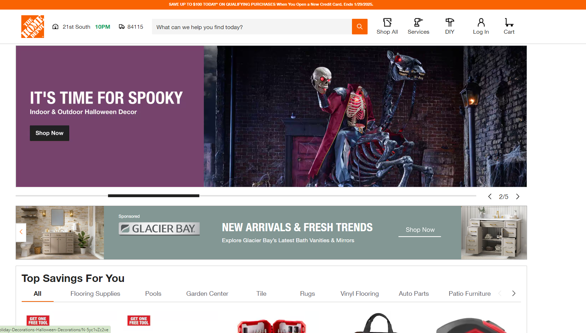
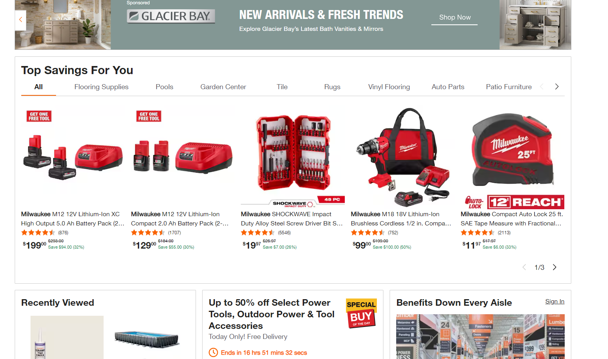
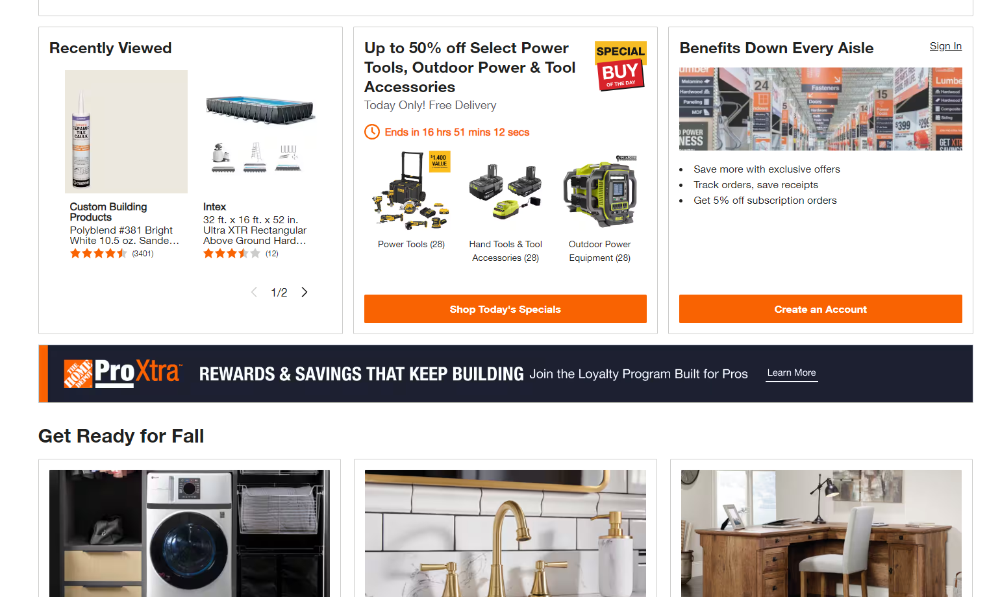
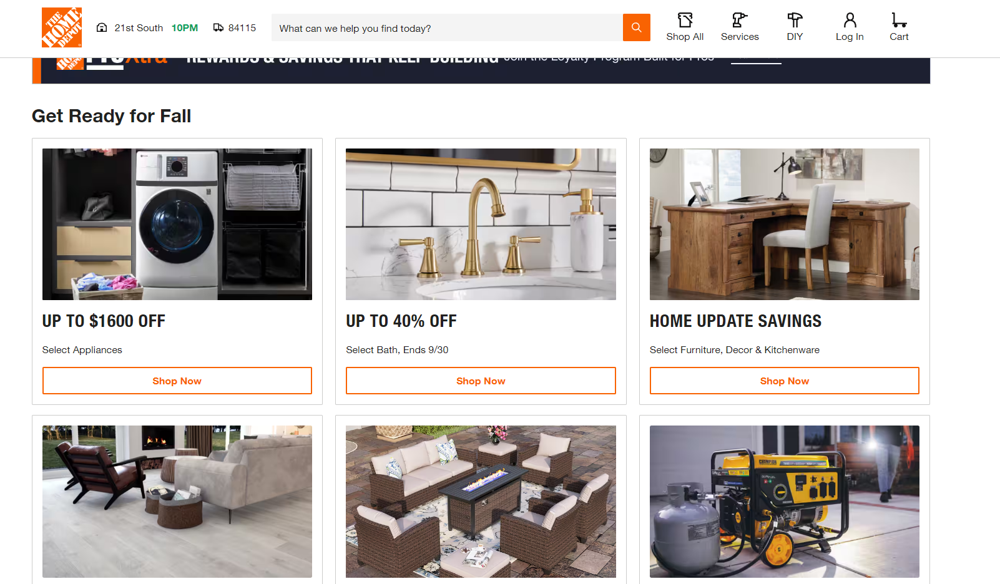
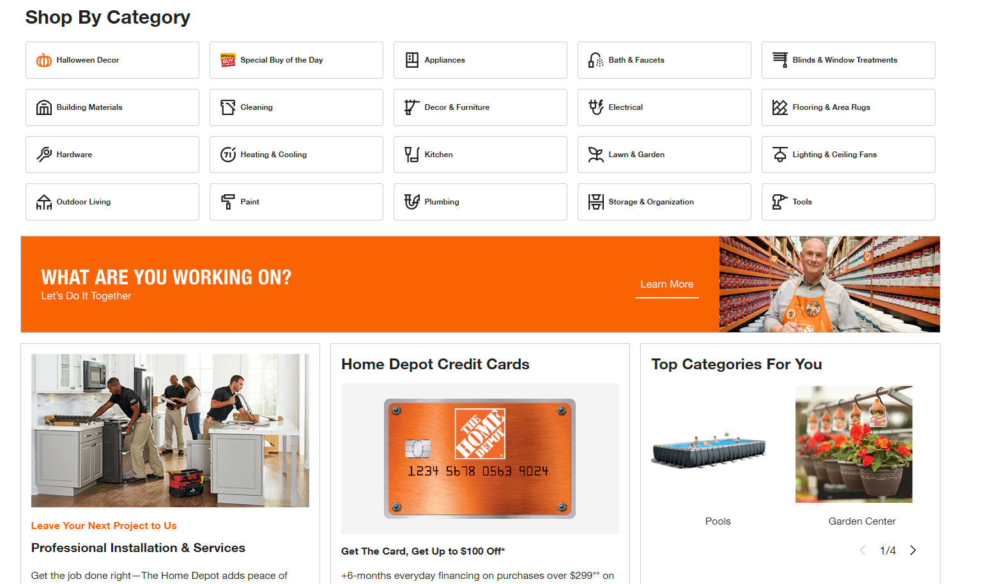
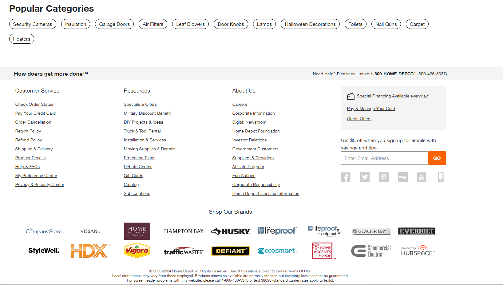

[ &#127968; Return To Design Info](../design_info.md)

# Design Layout Brainstorm

The purpose of this document is to brainstorm the layout of the design for the project. This will include the layout of the components and the overall design of the project. This will include possible sections for each page and what elements should be included in each. This will aid in the creation of wire frames and prototypes for the project.

## Table of Contents

[**Site Intent**](#site-intent) 
[**Profile Page**](#profile-page) 
[**Category Page**](#category-page) 
[**Product Page**](#product-page) 
[**Admin page**](#admin-page) 
[**Order management page**](#order-management-page) 
[**Cart Page**](#cart-page) 
[**Checkout Page**](#checkout-page) 
[**Login Page**](#login-page) 
[**Register Page**](#register-page) 
[**Forgot Password Page**](#forgot-password-page) 
[**Reset Password Page**](#reset-password-page) 
[**Contact Page**](#contact-page) 
[**About Page**](#about-page) 
[**Privacy Policy Page**](#privacy-policy-page) 
[**Terms of Service Page**](#terms-of-service-page) 
[**404 Page**](#404-page) 
[**Error page**](#error-page) 
[**Home Page**](#home-page) 
[**Examples**](#examples) 
    - [**Home Depot**](#home-depot) 

## Site Intent

Due to how quickly end-user bounce can occur, the home page / landing page should be designed to quickly and effectively communicate the purpose of the site. The user should be able to quickly understand what the site is about and what they can do on the site. The user should be able to quickly navigate to the most important sections of the site. A clear navigation of the site should be present on the home page and there should be multiple avenues for the user to navigate to the most important sections of the site.

## Home Page

The home page will be the first page that the user sees when they visit the site. It should be designed to quickly provide the user with items they may purchase. This could be by means of suggestion or history of searching. The home page should also provide a way for the user to quickly find products they are looking for. This should be down though multiple means including: categories, product images and names, and others.

### Required sections

- **Header**
    - *Logo*:  the logo of the company the site was made for. This should be clickable and take the user to the home page. The image should be a .svg so that it can be scaled to any size.
    - *Nav bar*: The nav bar should contain links to the most common categories to easy allow the user to find desired products.
    - *Search Bar*: The search bar will allow the user to search for products by name or category.
    - *Login / Register / Profile*: This will switch depending on if the user is logged in or not. A circle with the first letter of the user's username will be displayed if the user is logged in. If the user is not logged in, a login and register button will be displayed.
    - *Cart*: An icon representing the user's cart will be displayed. If the user has items in their cart, a number will be displayed next to the icon representing the number of items in the cart.
- **Hero**
    - *Carousel*:  A carousel of images of products that the user may be interested in. This will be clickable and will take the user to the product page. This should  include any sales or specials the website is having.
- **For You**
    - *Product Suggestion Cards*:  These will be cards that display a product that the user may be interested in. This will be based on the user's search history and other factors. The user will be able to click on the card to go to the product page. If the user is not logged in, the cards will be random.
- **Categories**
    - *Category Cards*:  These will be cards that display a category of products. The user will be able to click on the card to go to the category page.
- **Footer**

## Profile Page
The profile page is where the user will be able to see their profile information. This will include their profile picture, username, email, address, purchase history, current orders, and the ability to change their password.

- *Profile Picture*:   The user will be able to upload a profile picture. This will be displayed in a circle.
    - *Username*:   The username of the user will be displayed.
    - *Email*:   The email of the user will be displayed.
    - *Address*:   The address of the user will be displayed.
    - *Purchase History*:   The user will be able to see their purchase history. This will include the date of purchase, the product purchased, the price of the product, and the status of the order.
    - *Current Orders*:   The user will be able to see their current orders. This will include the date of purchase, the product purchased, the price of the product, and the status of the order.
    - *Change Password*:   The user will be able to change their password.

## Change Password
This page will include a form that will allow the user to change their password. This page will only be available to a user that is logged in. This will include the following fields:
- *Old Password*:   The user will be able to enter their old password.
    - *New Password*:   The user will be able to enter their new password.
    - *Confirm Password*:   The user will be able to confirm their new password.
    - *Submit*:   The user will be able to submit the form to change their password.

## Category Page
This page will list categories that the user can click on to see products in that category. This will include the name of the category, the image of the category, and the number of products in the category.
- *Category Image List*: The user will be able to see a list of categories. This will include the name of the category, the image of the category, and the number of products in the category.

## Product Page
- *Product Image*:   The user will be able to see an image of the product.
    - *Product Name*:   The user will be able to see the name of the product.
    - *Product Price*:   The user will be able to see the price of the product.
    - *Product Description*:   The user will be able to see the description of the product.
    - *Add to Cart*:   The user will be able to add the product to their cart.
    - *Quantity*:   The user will be able to select the quantity of the product they would like to purchase.
    - *Modifiers*:   The user will be able to select any modifiers for the product.
    - *Similar Products*:   The user will be able to see similar products to the product they are viewing.

## Admin page
The admin page will only be available to users with admin privileges. This page will allow the admin to add, edit, and delete products. This will include the following sections:
 - *Add Product*:   The admin will be able to add a product. This will include the name of the product, the price of the product, the description of the product, the image of the product, the category of the product, and any modifiers for the product.
    - *Edit Product*:   The admin will be able to edit a product. This will include the name of the product, the price of the product, the description of the product, the image of the product, the category of the product, and any modifiers for the product.
    - *Delete Product*:   The admin will be able to delete a product. This will include the name of the product, the price of the product, the description of the product, the image of the product, the category of the product, and any modifiers for the product.
 - View Orders: The admin will be able to view all orders. This will include the date of purchase, the product purchased, the price of the product, the status of the order, and the user who purchased the product.
    - *Edit Order*:   The admin will be able to edit an order. This will include the date of purchase, the product purchased, the price of the product, the status of the order, and the user who purchased the product.
    - *Delete Order*:   The admin will be able to delete an order. This will include the date of purchase, the product purchased, the price of the product, the status of the order, and the user who purchased the product.
    - *Add Hero*:   The admin will be able to add hero content that will be shown on the home page. This will include:
        - *Image*:   The hero image that will be shown on the home page.
        - *Link*:   The link that the image will take the user to when clicked.
        - *Title*:   The title of the hero.
        - *Description*:   The description of the hero.
    - *Edit Hero*:   The admin will be able to edit hero content that will be shown on the home page. This will include:
    - *Delete Hero*:   The admin will be able to delete hero content that will be shown on the home page. This will include:
    - *Add Category*:   The admin will be able to add a category. This will include the name of the category, the image of the category, and the number of products in the category.
    - *Edit Category*:   The admin will be able to edit a category. This will include the name of the category, the image of the category, and the number of products in the category.
    - *Delete Category*:   The admin will be able to delete a category. This will include the name of the category, the image of the category, and the number of products in the category.
## Product Management Page
  - Used to edit a single product.

## Order management page

## Category Management Page

## Edit Hero

## Edit Order page

## Cart Page
The cart page will display items in the user's cart. The user wil be able to see each products information including name, price, quantity, and modifiers. The user will be able to change the quantity of the product and remove the product from the cart. The user will also be able to see the total price of the cart and proceed to checkout.
 - *Product List*:   The user will be able to see a list of products in their cart. This will include the name of the product, the price of the product, the quantity of the product, and any modifiers for the product.
    - *Total Price*:   The user will be able to see the total price of the cart.
    - *Proceed to Checkout*:   The user will be able to proceed to checkout.
    - *Remove Product*:   The user will be able to remove a product from their cart.

## Checkout Page
The checkout page will be the conformation page before purchasing the items in the user's cart. Here, the user will be able to insert their shipping information and payment information. The user will also be able to see the total price of the cart and the total price of the order.
 - *Shipping Information*:   The user will be able to enter their shipping information. This will include their name, address, city, state, zip code, and phone number.
    - *Payment Information*:   The user will be able to enter their payment information. This will include their credit card number, expiration date, and CVV.
    - *Total Price*:   The user will be able to see the total price of the cart and the total price of the order.
    - *Place Order*:   The user will be able to place the order.

## Checkout Confirmation Page
The checkout confirmation page will be displayed after the user has placed their order. This will include the order number, the date of purchase, the products purchased, the price of the products, the shipping information, and the payment information.
 - *Order Number*:   The user will be able to see the order number.
    - *Date of Purchase*:   The user will be able to see the date of purchase.
    - *Products Purchased*:   The user will be able to see the products purchased. This will include the name of the product, the price of the product, the quantity of the product, and any modifiers for the product.
    - *Shipping Information*:   The user will be able to see the shipping information. This will include their name, address, city, state, zip code, and phone number.
    - *Payment Information*:   The user will be able to see the payment information. This will include their credit card number, expiration date, and CVV.

## Login Page
The login page will allow users to enter there username/email and password to login to the site. The user will also be able to click a link to go to the register page.
 - *Username/Email*:   The user will be able to enter their username or email.
    - *Password*:   The user will be able to enter their password.
    - *Login*:   The user will be able to login.
    - *Register*:   The user will be able to go to the register page.

## Register Page
The register page will allow users to create an account on the site. The user will be able to enter their username, email, password, and confirm password. The user will also be able to click a link to go to the login page.
 - *Username*:   The user will be able to enter their username.
    - *Email*:   The user will be able to enter their email.
    - *Password*:   The user will be able to enter their password.
    - *Confirm Password*:   The user will be able to confirm their password.
    - *Shipping Information*:   The user will be able to enter their shipping information. This will include their name, address, city, state, zip code, and phone number.
    - *Register*:   The user will be able to register.
    - *Login*:   The user will be able to go to the login page.

## Forgot Password Page
The forgot password page will allow users to reset their password. The user will be able to enter their email to submit to the server, the server will send a code to the user to use for password reset. The code will need to be store in the database for verification along with an expiration time for the code.
 - *Email*:   The user will be able to enter their email.
    - *Reset Password*:   The user will be able to reset their password.
 - *Reset Code*:   the user will be able to enter the reset code that was sent to their email and it will be accepted as long as the expiration time has not been exceeded.

## Reset Password Page
The reset password page will allow users to reset their password if they have forgotten it. After entering the code that was send to their email, the user will be directed to this page. The user will have to enter their new password and confirm it.
 - *New Password*:   The user will be able to enter their new password.
    - *Confirm Password*:   The user will be able to confirm their new password.
    - *Submit*:   The user will be able to submit the form to reset their password.

## Contact Page
The contact page will allow users to contact the site owner. The user will be able to enter their name, email, and message. The user will also be able to submit the form to contact the site owner.
 - *Name*:   The user will be able to enter their name.
    - *Email*:   The user will be able to enter their email.
    - *Message*:   The user will be able to enter their message.
    - *Submit*:   The user will be able to submit the form to contact the site owner.

## About Page
The about page will provide information about the site. This will include the history of the site, the purpose of the site, and the team behind the site.
 - *History*:   The user will be able to see the history of the site.
    - *Purpose*:   The user will be able to see the purpose of the site.
    - *Team*:   The user will be able to see the team behind the site.

## Privacy Policy Page
The privacy policy page will provide information about the privacy policy of the site. This will include how the site collects and uses data, how the site protects data, and how the site shares data.
 - *Data Collection*:   The user will be able to see how the site collects data.
    - *Data Protection*:   The user will be able to see how the site protects data.
    - *Data Sharing*:   The user will be able to see how the site shares data.

## Terms of Service Page
The terms of service page will provide information about the terms of service of the site. This will include the rules and regulations of the site, the rights and responsibilities of the user, and the rights and responsibilities of the site.
 - *Rules and Regulations*:   The user will be able to see the rules and regulations of the site.
    - *Rights and Responsibilities*:   The user will be able to see the rights and responsibilities of the user.
    - *Rights and Responsibilities*:   The user will be able to see the rights and responsibilities of the site.

## 404 Page
The 404 page will be displayed when the user tries to access a page that does not exist. This will include a message that the page does not exist and a link to go back to the home page.

## Error page
The error page will be displayed for generic errors that are not 404 errors. This will include a message that an error has occurred and a link to go back to the home page.

## Examples

### [Home Depot](https://www.homedepot.com/)

