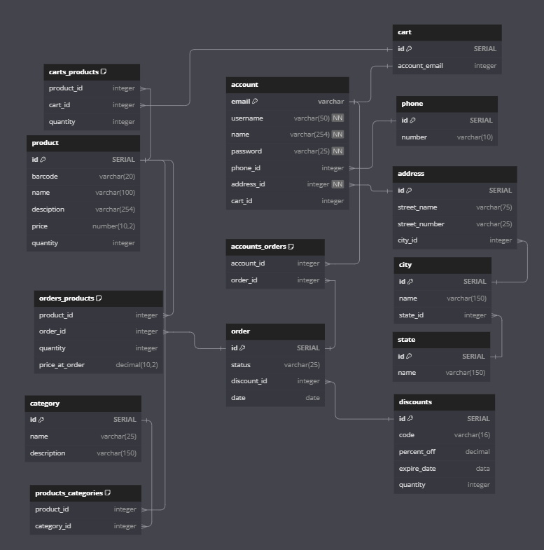

# E-Commerce Project Design Information

## Quick Links

[**Style Guide**](design_docs/style_guide.md)  
[**Scope Document**](design_docs/scope_document.md)  
[**Component Planning**](design_docs/component_planning.md)  
[**Redux Store Documentation**](design_docs/redux_store_documentation.md)  
[**Testing Documentation**](design_docs/testing_documentation.md)

## Table of Contents

[**Technology Stack**](#technology-stack) 
[**Database Schema**](#database-schema) 
[**API Documentation**](#api-documentation) 
[**Wireframes and Mockups**](#wireframes-and-mockups) 

---

## Technology Stack

## Database Schema

The schema can be found at [dbdiagram.io](https://dbdiagram.io/d/E-Commerce-Codecademy-66b97b108b4bb5230ed3f102)

The current schema is pictured below:

## API Documentation

The API documentation has been created using Swagger Editor. The file [ecommerce-swagger.yaml](ecommerce-swagger.yaml) can be uploaded to the Swagger editor either [online](https://editor.swagger.io/) or desktop to view the documentation.

## Wireframes and Mockups
